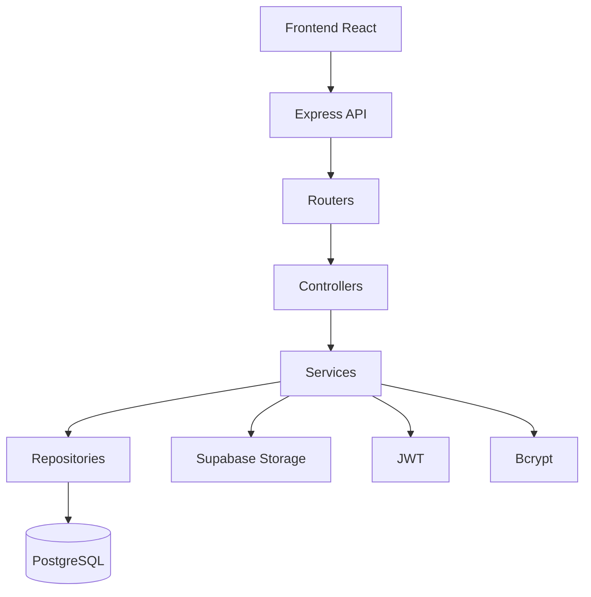

# SheliGo_Backend

Backend de **SheliGo**, una plataforma para la gestión de objetos perdidos y encontrados dentro de instituciones como escuelas, universidades, clubes y empresas.

El sistema permite administrar publicaciones de objetos perdidos y encontrados, autenticación de usuarios, preguntas y respuestas, chats, carga de imágenes y futuras funcionalidades de matching mediante inteligencia artificial.

---

# Tecnologías

- Node.js
- Express
- TypeScript
- PostgreSQL
- Supabase
- JWT (JSON Web Token)
- Bcrypt
- Multer
- Sharp
- Zod
- Helmet
- CORS
- Express Rate Limit

---

# Arquitectura

El proyecto sigue una arquitectura por capas para mantener el código organizado y escalable.

```
src
│
├── controllers
├── services
├── repositories
├── entities
├── routers
├── middlewares
├── validations
├── database
├── helpers
├── errors
└── storage
```

### Controllers

Reciben las peticiones HTTP y devuelven la respuesta correspondiente.

### Services

Contienen toda la lógica de negocio.

### Repositories

Se encargan exclusivamente del acceso a PostgreSQL.

### Entities

Representan las entidades del sistema.

### Middlewares

Validaciones, autenticación y manejo de errores.

### Helpers

Funciones reutilizables del proyecto.

---

# Funcionalidades implementadas

## Autenticación

- Registro de usuarios
- Inicio de sesión
- Login mediante Google
- JWT
- Contraseñas cifradas con Bcrypt

## Usuarios

- Obtener información del usuario
- Actualizar foto de perfil

## Publicaciones

- Crear publicación
- Eliminar publicación
- Obtener detalle
- Obtener publicaciones recientes
- Buscar publicaciones mediante filtros

## Preguntas

- Crear preguntas
- Responder preguntas
- Obtener preguntas de una publicación

## Instituciones

- Obtener instituciones

## Categorías

- Obtener categorías

## Chat

- Comunicación entre usuarios

---

# Seguridad

El proyecto implementa diversas medidas de seguridad:

- Contraseñas cifradas con Bcrypt.
- Tokens JWT para autenticación.
- Validaciones utilizando Zod.
- Helmet para agregar cabeceras HTTP seguras.
- Configuración de CORS.
- Limitación de peticiones mediante Express Rate Limit.
- Validaciones tanto en frontend como en backend.

---

# Instalación

## Clonar el repositorio

```bash
git clone <URL_DEL_REPOSITORIO>
```

## Instalar dependencias

```bash
npm install
```
o
```bash
instalador.cmd
```

## Crear el archivo `.env`

Ejemplo:

```env
DB_HOST=
DB_PORT=
DB_DATABASE=
DB_USER=
DB_PASSWORD=
DB_POOL_MAX=10
DB_POOL_IDLE_TIMEOUT_MS=30000
DB_POOL_CONNECTION_TIMEOUT_MS=2000

# Secreto aleatorio de al menos 32 caracteres.
JWT_SECRET=

SUPABASE_URL=
SUPABASE_SERVICE_ROLE_KEY=
SUPABASE_BUCKET=avatars
```

El arranque valida que estén configuradas las variables requeridas de PostgreSQL,
JWT y Supabase Storage. El mismo esquema de contraseña se aplica al registro y
al cambio de contraseña: mínimo 8 caracteres, máximo 100, al menos una mayúscula
y un número. El hash usa bcrypt con costo 12.

## Ejecutar

```bash
npm run dev
```

El servidor iniciará por defecto en:

```
http://localhost:3000
```

Para compilar y arrancar en producción:

```bash
npm run build
npm start
```

---

# Endpoints principales

## Auth

```
POST /auth/register
POST /auth/login
POST /auth/logout
POST /auth/google
```

## Usuarios

```
GET /usuarios/me
GET /usuarios/:id
```

## Publicaciones

```
GET    /publicaciones/recientes
GET    /publicaciones/search
GET    /publicaciones/:id
GET    /publicaciones/:id/archivos
GET    /publicaciones/:id/preguntas

POST   /publicaciones
POST   /publicaciones/:id/preguntas
POST   /publicaciones/preguntas/:preguntaId/respuesta

DELETE /publicaciones/:id
```

## Categorías

```
GET /categorias
```

## Instituciones

```
GET /instituciones
```

---

# Estado del proyecto

Actualmente el proyecto continúa en desarrollo.

Próximas funcionalidades previstas:

- Sistema de Matches mediante IA.
- Historial de actividad.
- Sistema de reclamos.
- Recuperación de objetos.
- Mejoras en perfiles de usuario.
- Notificaciones.
- Panel administrativo.

---

# Convenciones

- Arquitectura por capas.
- Código escrito en TypeScript.
- UUID como identificador principal.
- Validaciones con Zod.
- Base de datos PostgreSQL.
- Imágenes almacenadas en Supabase Storage.

## Carga de imágenes

- Registro y edición de perfil: un archivo opcional en el campo `foto`.
- Mensajes de chat: un archivo opcional en el campo `foto`.
- Publicaciones: hasta cinco archivos en el campo `imagenes`.
- Se aceptan imágenes JPEG, PNG y WEBP, con un máximo de 8 MiB por archivo.
- Las solicitudes multipart tienen límites de cantidad y tamaño para archivos y campos.

## Arquitectura



# Autores

Proyecto desarrollado como trabajo académico para ORT Argentina.

Equipo de desarrollo: **SheliGo**.
