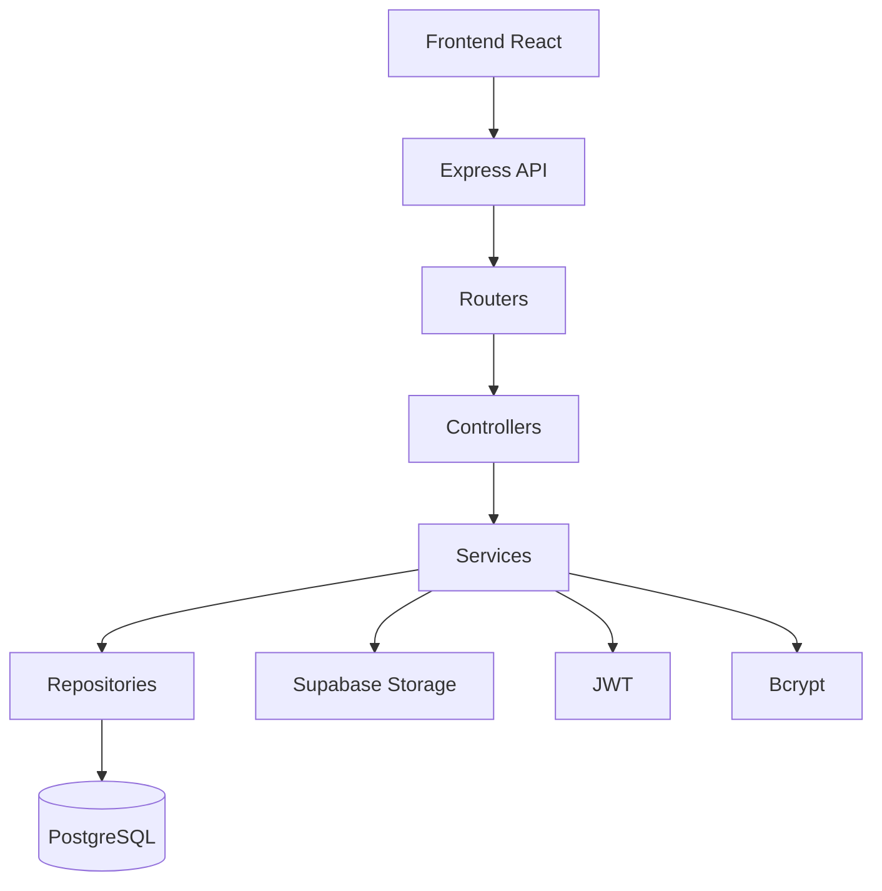

# SheliGo_Backend

Backend de **SheliGo**, una plataforma para la gestión de objetos perdidos y encontrados dentro de instituciones como escuelas, universidades, clubes y empresas.

El sistema permite administrar publicaciones de objetos perdidos y encontrados, autenticación de usuarios, preguntas y respuestas, chats, carga de imágenes y futuras funcionalidades de matching mediante inteligencia artificial.

---

# Tecnologías

- Node.js
- Express
- TypeScript
- PostgreSQL
- Supabase
- JWT (JSON Web Token)
- Bcrypt
- Multer
- Sharp
- Zod
- Helmet
- CORS
- Express Rate Limit

---

# Arquitectura

El proyecto sigue una arquitectura por capas para mantener el código organizado y escalable.

```
src
│
├── controllers
├── services
├── repositories
├── entities
├── routers
├── middlewares
├── validations
├── database
├── helpers
├── errors
└── storage
```

### Controllers

Reciben las peticiones HTTP y devuelven la respuesta correspondiente.

### Services

Contienen toda la lógica de negocio.

### Repositories

Se encargan exclusivamente del acceso a PostgreSQL.

### Entities

Representan las entidades del sistema.

### Middlewares

Validaciones, autenticación y manejo de errores.

### Helpers

Funciones reutilizables del proyecto.

---

# Funcionalidades implementadas

## Autenticación

- Registro de usuarios
- Inicio de sesión
- Login mediante Google
- JWT
- Contraseñas cifradas con Bcrypt

## Usuarios

- Obtener información del usuario
- Actualizar foto de perfil

## Publicaciones

- Crear publicación
- Eliminar publicación
- Obtener detalle
- Obtener publicaciones recientes
- Buscar publicaciones mediante filtros

## Preguntas

- Crear preguntas
- Responder preguntas
- Obtener preguntas de una publicación

## Instituciones

- Obtener instituciones

## Categorías

- Obtener categorías

## Chat

- Comunicación entre usuarios

## Backoffice (`/admin`)

- Dashboard con indicadores, actividad de los últimos 14 días y auditoría reciente
- Usuarios: listado, detalle, cambio de rol y membresías a instituciones
- Publicaciones: moderación (cambiar estado, baja lógica y restauración)
- Instituciones: alta, edición (con foto) y baja
- Categorías: alta, edición y baja

Ver la sección **Backoffice** más abajo.

---

# Seguridad

El proyecto implementa diversas medidas de seguridad:

- Contraseñas cifradas con Bcrypt.
- Tokens JWT para autenticación.
- Validaciones utilizando Zod.
- Helmet para agregar cabeceras HTTP seguras.
- Configuración de CORS.
- Limitación de peticiones mediante Express Rate Limit.
- Validaciones tanto en frontend como en backend.
- Backoffice protegido en el backend: rol leído de la base en cada request (ver **Backoffice**).

---

# Instalación

## Clonar el repositorio

```bash
git clone <URL_DEL_REPOSITORIO>
```

## Instalar dependencias

```bash
npm install
```
o
```bash
instalador.cmd
```

## Crear el archivo `.env`

Ejemplo:

```env
DB_HOST=
DB_PORT=
DB_DATABASE=
DB_USER=
DB_PASSWORD=
DB_POOL_MAX=10
DB_POOL_IDLE_TIMEOUT_MS=30000
DB_POOL_CONNECTION_TIMEOUT_MS=2000

# Secreto aleatorio de al menos 32 caracteres.
JWT_SECRET=

SUPABASE_URL=
SUPABASE_SERVICE_ROLE_KEY=
SUPABASE_BUCKET=avatars
```

El arranque valida que estén configuradas las variables requeridas de PostgreSQL,
JWT y Supabase Storage. El mismo esquema de contraseña se aplica al registro y
al cambio de contraseña: mínimo 8 caracteres, máximo 100, al menos una mayúscula
y un número. El hash usa bcrypt con costo 12.

## Ejecutar

```bash
npm run dev
```

El servidor iniciará por defecto en:

```
http://localhost:3000
```

Para compilar y arrancar en producción:

```bash
npm run build
npm start
```

---

# Endpoints principales

## Auth

```
POST /auth/register
POST /auth/login
POST /auth/logout
POST /auth/google
```

## Usuarios

```
GET /usuarios/me
GET /usuarios/:id
```

## Publicaciones

```
GET    /publicaciones/recientes
GET    /publicaciones/search
GET    /publicaciones/:id
GET    /publicaciones/:id/archivos
GET    /publicaciones/:id/preguntas

POST   /publicaciones
POST   /publicaciones/:id/preguntas
POST   /publicaciones/preguntas/:preguntaId/respuesta

DELETE /publicaciones/:id
```

## Categorías

```
GET /categorias
```

## Instituciones

```
GET /instituciones
```

---

# Backoffice

Panel de administración servido bajo `/admin`. La protección real está en el backend: ocultar `/admin` en React es solo una comodidad visual.

## Puesta en marcha

1. Aplicar la migración en Supabase (SQL Editor). Es idempotente, se puede correr más de una vez:

   ```
   migrations/001-backoffice-roles-y-auditoria.sql
   ```

   - Permite los roles `user`, `institution_admin` y `admin` en `usuarios.rol`.
   - Agrega `usuarios_instituciones.es_admin` (qué instituciones administra un `institution_admin`).
   - Elimina membresías duplicadas y agrega el índice único `(usuario_id, institucion_id)`.
   - Crea `auditoria_admin` (con RLS activo y sin políticas: solo la usa el backend).

2. Asignar el primer administrador general:

   ```sql
   UPDATE public.usuarios SET rol = 'admin' WHERE email = 'tu-email@dominio.com';
   ```

   Los siguientes roles se asignan desde el propio backoffice (Usuarios → Cambiar rol).

Mientras la migración no esté aplicada, `/admin` responde `503` y el resto de la API funciona igual.

## Roles y permisos

| Acción | `admin` | `institution_admin` | `user` |
|---|---|---|---|
| Dashboard | Toda la plataforma | Sus instituciones | 403 |
| Ver usuarios | Todos | Miembros de sus instituciones | 403 |
| Cambiar rol / membresías | Sí | No | 403 |
| Ver y moderar publicaciones | Todas | Las de sus instituciones | 403 |
| Ver / editar instituciones | Todas | Solo las suyas | 403 |
| Crear / eliminar instituciones | Sí | No | 403 |
| Ver categorías | Sí | Sí (solo lectura) | 403 |
| Crear / editar / eliminar categorías | Sí | No | 403 |

## Cómo se protege

1. `authMiddleware` valida el JWT (`401`).
2. `requireAdminAccess` (`src/middlewares/admin-middleware.ts`) lee `usuarios.rol` y las instituciones con `es_admin = true` **desde la base en cada request**. El JWT solo trae `userId`, así que quitar un rol tiene efecto inmediato (`403`).
3. `requireGlobalAdmin` restringe las acciones del admin general (`403`).
4. El alcance por institución se aplica en servicios y repositorios: un filtro por una institución ajena devuelve `403` y un recurso ajeno, `404`.

Además:

- Toda acción que modifica datos se registra en `auditoria_admin` dentro de la misma transacción.
- Las publicaciones nunca se borran físicamente: “eliminar” es `estado = 'eliminada'` y se puede restaurar.
- Instituciones y categorías con datos asociados no se pueden eliminar (`409`).
- Nadie puede cambiar su propio rol.
- Las respuestas llevan `Cache-Control: no-store`.

## Endpoints

Todas las listas aceptan `?page=1&limit=20&search=texto` (`limit` máximo 100) y responden:

```json
{ "status": "success", "data": { "items": [], "page": 1, "limit": 20, "total": 0, "total_pages": 0 } }
```

```
GET    /admin/me                         Sesión, alcance y permisos para la interfaz
GET    /admin/dashboard

GET    /admin/usuarios                   ?rol=&institucion_id=
GET    /admin/usuarios/:id
PATCH  /admin/usuarios/:id/rol           { rol, instituciones_ids? }      (admin)
PUT    /admin/usuarios/:id/instituciones { instituciones_ids }          (admin)

GET    /admin/publicaciones              ?estado=&tipo=&institucion_id=&categoria_id=&usuario_id=
GET    /admin/publicaciones/:id
PATCH  /admin/publicaciones/:id/estado   { estado, motivo? }

GET    /admin/instituciones
GET    /admin/instituciones/:id
POST   /admin/instituciones              multipart: nombre, email, direccion, telefono, latitud, longitud, foto   (admin)
PATCH  /admin/instituciones/:id          mismos campos + eliminarFoto
DELETE /admin/instituciones/:id                                          (admin)

GET    /admin/categorias
POST   /admin/categorias                 { nombre, descripcion? }        (admin)
PATCH  /admin/categorias/:id             { nombre?, descripcion? }       (admin)
DELETE /admin/categorias/:id                                             (admin)
```

Login (`POST /auth/login`) y `GET /usuarios/me` ahora incluyen `rol` (campo agregado, no cambia el resto de la respuesta).

---

# Estado del proyecto

Actualmente el proyecto continúa en desarrollo.

Próximas funcionalidades previstas:

- Sistema de Matches mediante IA.
- Historial de actividad.
- Sistema de reclamos.
- Recuperación de objetos.
- Mejoras en perfiles de usuario.
- Notificaciones.

---

# Convenciones

- Arquitectura por capas.
- Código escrito en TypeScript.
- UUID como identificador principal.
- Validaciones con Zod.
- Base de datos PostgreSQL.
- Imágenes almacenadas en Supabase Storage.

## Carga de imágenes

- Registro y edición de perfil: un archivo opcional en el campo `foto`.
- Mensajes de chat: un archivo opcional en el campo `foto`.
- Publicaciones: hasta cinco archivos en el campo `imagenes`.
- Se aceptan imágenes JPEG, PNG y WEBP, con un máximo de 8 MiB por archivo.
- Las solicitudes multipart tienen límites de cantidad y tamaño para archivos y campos.

## Arquitectura



# Autores

Proyecto desarrollado como trabajo académico para ORT Argentina.

Equipo de desarrollo: **SheliGo**.
